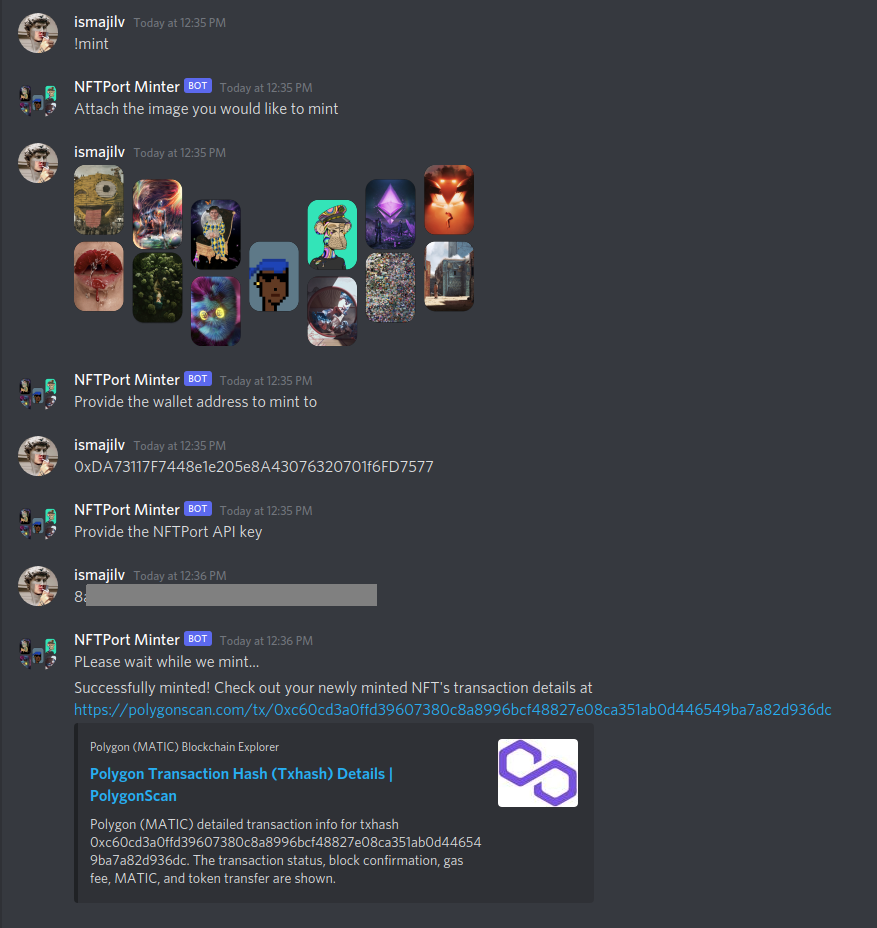

# Discord Minting Bot backed by NFTPort API

Minting in nutshell:



## NFTPort API doc

* https://docs.nftport.xyz/docs/nftport/b3A6MjE2NjM5MDM-easy-minting-w-url

## Discord Bot API doc

* https://discordpy.readthedocs.io/en/stable/ext/commands/api.html

## How to run

1. Create new application and bot in [discord developers](https://discord.com/developers/applications) page
2. Copy the newly created BOT token and update it in [.env](./.env) file
3. Run the code:

```shell
python3 -m bot
```
